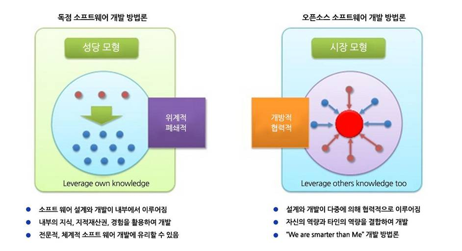
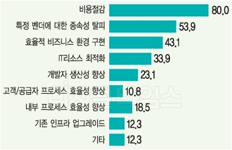

## 2.2 오픈소스 개발의 특징

독점 소프트웨어의 클로즈드 소스와는 달리 오픈소스는 일반에 공개되어 있기 때문에 진입장벽이 낮다. 이러한 특성은 많은 변화를 만들어내고 있다.

예를 들면, 과거 SI가 주류를 이루던 이전의 소프트웨어 개발은 체계적이고 전문적인 개발 형태가 다수였다. 그래서 하나가 완성되면 그 다음 순서로 넘어가고 그 다음 것이 완성되면 또 그 다음이 수행되는 **선형적 구조**의 개발형태였다면, 오픈소스 중심의 프로젝트의 경우는 내/외부의 협력이 모여 하나의 SW을 만드는 **비선형적 구조**이다. 때문에, 개발이나 안정화 시간이 짧으며, 결과적으로 비용절감이나 최적화된 리소스 활용, 효율성 향상의 이점을 가져오게 된다.

#### <그림1> 독점 소프트웨어와 오픈소스 개발 방법론의 비교

> 출처: 오픈소스컨설팅

그림 1을 보면, 독자적인 소프트웨어 개발은 외적인 요소는 배제되고 철저히 내부적 요소로만 개발이 되기 때문에, 소프트웨어공학에는 가장 잘 어울리는 모델이지만 최근의 트렌드와는 다소 동떨어진 것으로 볼 수 있다. 또한, 요구사항에 가장 적합할 수는 있지만 개발 시간도 오래 걸리고 안정화 되는데도 매우 오래 걸리는 단점이 있다. 반면에 우측의 오픈소스 모델은 프로젝트 내외부에서 필요한 부분을 협력하면서 개발하기 때문에 개발이나 안정화 시간이 짧다. 거기에서 비용절감이나 최적화된 리소스 활용, 효율성 향상 등이 기대될 수 있다.

#### <표1> 기존 소프트웨어와 오픈소스 적용 소프트웨어의 가치 추구 비교

| 구분  | 기존 소프트웨어 | 오픈소스 적용 소프트웨어       |
| :------------ | :-----------: | -------------------: |
| R&D     | 상당한 투자가 수반된 기존 내부 R&D 기반 | 열린 지식을 통한 개방형 혁신 |
| 전략    | 가치를 창출하는 자원을 소유하고 통제    | -  개방 사용자가 제품의 품질 다양성에 기여   - 타 회사가 보완재를 생산   - 더 많은 사용자가 모임|
| 사업모델     | 제품기반  | 서비스 기반 |

> 출처: 소프트웨어정책연구소

#### <그림2> 오픈소스를 도입한 이유

> 출처: 오픈소스컨설팅

그림 2에서 볼수 있듯이 오픈소스를 사용하는 이유는 비용절감이 가장 크고 종속성 탈피, 효율적인 비즈니스 환경 구현 순으로 다양하게 나타나고 있다.

 

"**백지장도 맞들면 낫다**"라는 속담처럼 소프트웨어 개발은 팀 단위로 진행되는 것이 일반적이다. 소프트웨어를 협업 형태로 개발하면 토론을 통해 올바른 방향을 선택할 수 있으며, 미처 발견하지 못한 코드 오류를 훨씬 수월하게 찾을 수 있다. 결국, 오픈소스SW 인해 생기는 많은 변화들은 개발환경에 영향을 끼쳤고, 이는 IT환경에 새로운 혁신을 가져다 주었다.

#### 이미지 출처
- 정보산업진흥원: http://www.sw-eng.kr/member/customer/Webzine/BoardView.do?boardId=00000000000000047136&currPage=&searchPrefaceId=&titOrder=&writeOrder=&regDtOrder=&searchCondition=TOT&searchKeyword=

- 삼성뉴스룸: https://news.samsung.com/kr/%EC%86%8C%ED%94%84%ED%8A%B8%EC%9B%A8%EC%96%B4%EB%8F%84-%EB%A7%9E%EB%93%A4%EB%A9%B4-%EB%82%AB%EB%8B%A4-%EA%B0%88%EC%88%98%EB%A1%9D-%ED%9E%98-%EC%96%BB%EB%8A%94-%EC%98%A4%ED%94%88%EC%86%8C

#### 내용 출처
- 정보산업진흥원: http://www.sw-eng.kr/member/customer/Webzine/BoardView.do?boardId=00000000000000047136&currPage=&searchPrefaceId=&titOrder=&writeOrder=&regDtOrder=&searchCondition=TOT&searchKeyword=

- 삼성뉴스룸: https://news.samsung.com/kr/%EC%86%8C%ED%94%84%ED%8A%B8%EC%9B%A8%EC%96%B4%EB%8F%84-%EB%A7%9E%EB%93%A4%EB%A9%B4-%EB%82%AB%EB%8B%A4-%EA%B0%88%EC%88%98%EB%A1%9D-%ED%9E%98-%EC%96%BB%EB%8A%94-%EC%98%A4%ED%94%88%EC%86%8C
